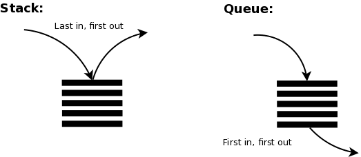

# Data-Structure-Using-Java

- These are my Data Structure and Algorithms course Lab work.
- The DOCS folder contian the requirements for all the Labs.

## ⚙️ Language used

 

## Data Structures and Algorithms:

 

- Singly Linked Lists

 
 

- Doubly Linlked Lists

 
 

- Stacks and Queues

 
 

- Recursion Algorithm

 
 

- Binary Trees

 
 

- Binary Search Trees

 
 

- AVL Trees

 
 

- Binary Heaps

 
 

- Graphs

 
 

- Hashing

 
 

## ✒️ Author

| [ @M-Alhassan](https://github.com/M-Alhassan) |
| :---------------------------------------------------------------------------------------------------------------------------: |
